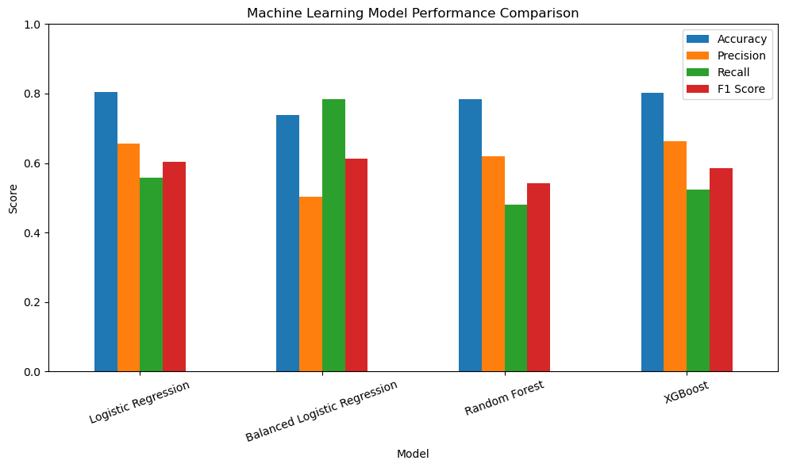
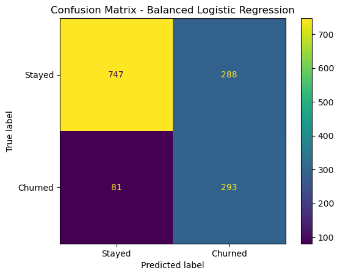
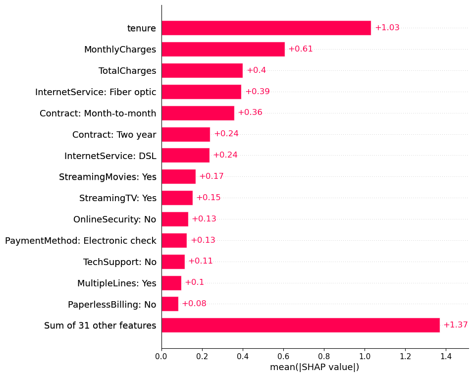
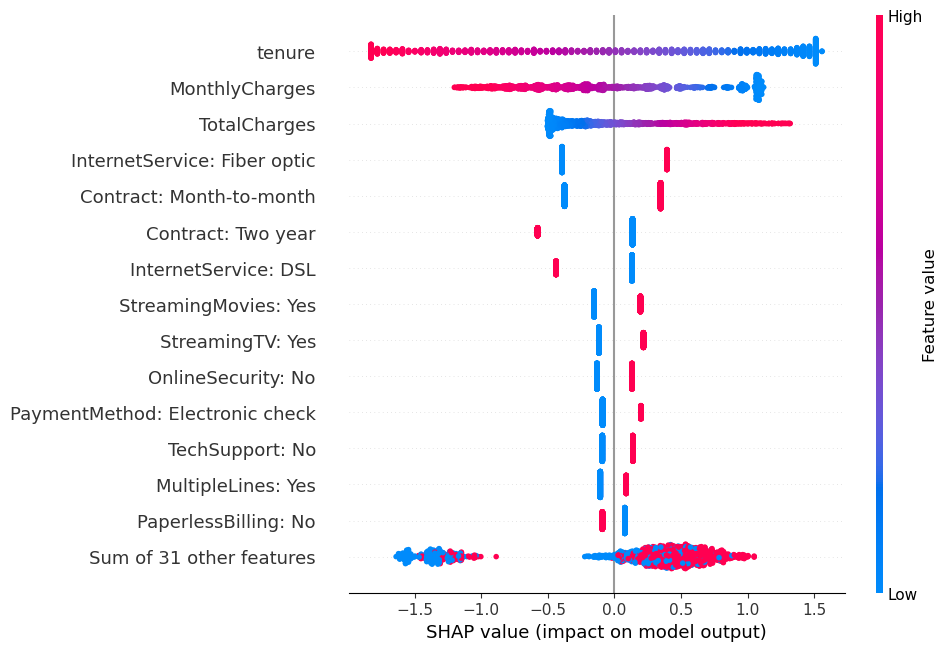

# ChurnLens AI

### Explainable Customer Churn Prediction using Machine Learning and SHAP

ChurnLens AI is a machine learning project designed to identify telecommunications customers who are at risk of leaving a company and explain the factors influencing those predictions.

The project combines customer churn prediction with explainable AI so that the model does not simply predict whether a customer may leave, but also provides insight into **why** the customer is considered a churn risk.

## Project Goal

The main goals of this project are to:

- Analyse customer behaviour and identify patterns associated with churn.
- Build and compare multiple machine learning models.
- Improve the detection of customers who are genuinely at risk of leaving.
- Use SHAP explainability to understand both overall model behaviour and individual customer predictions.

## Technologies & Libraries

This project was developed in Python using Jupyter Notebook.

- Python
- pandas 2.0.3
- NumPy 1.21.6
- Matplotlib 3.5.2
- scikit-learn 1.0.2
- XGBoost 2.1.4
- SHAP 0.49.1
- OpenCV Headless 4.10.0.84

The exact package versions used in the project are available in `requirements.txt`.

## Dataset

This project uses the IBM Telco Customer Churn dataset.

The dataset contains information about 7,043 telecommunications customers and includes 21 columns covering customer demographics, account information, subscribed services, billing details, and whether the customer churned.

Examples of features include:

- Customer tenure
- Contract type
- Internet service
- Monthly and total charges
- Payment method
- Tech support
- Online security
- Streaming services
- Customer churn status

The target variable is `Churn`, which indicates whether a customer left the company.

**Dataset source:** IBM Telco Customer Churn dataset, accessed through Kaggle.

## Machine Learning Models

Four machine learning approaches were evaluated:

1. Logistic Regression
2. Balanced Logistic Regression
3. Random Forest
4. XGBoost

The models were evaluated using Accuracy, Precision, Recall, and F1 Score.

| Model | Accuracy | Precision | Recall | F1 Score |
|---|---:|---:|---:|---:|
| Logistic Regression | 80.6% | 65.7% | 55.9% | 60.4% |
| Balanced Logistic Regression | 73.8% | 50.4% | **78.3%** | **61.4%** |
| Random Forest | 78.4% | 61.9% | 48.1% | 54.1% |
| XGBoost | 80.3% | **66.2%** | 52.4% | 58.5% |

### Model Performance Comparison

Although standard Logistic Regression achieved the highest overall accuracy, the Balanced Logistic Regression model achieved the highest recall and F1 score.

For this project, recall is especially important because the goal is to identify as many customers who are genuinely at risk of leaving as possible. For this reason, the Balanced Logistic Regression model was selected as the main churn prediction model.

### Confusion Matrix

## Key Findings

Exploratory analysis revealed several patterns associated with customer churn:

- Customers with shorter tenure were significantly more likely to churn.
- Month-to-month contracts had a much higher churn rate than one-year or two-year contracts.
- Fiber optic customers showed a higher churn rate than DSL customers.
- Customers using electronic check had a substantially higher churn rate than customers using other payment methods.
- Customers without Tech Support or Online Security were more likely to churn.
- Customers with longer-term contracts showed much lower churn rates.
- Customers who churned had higher monthly charges on average.

These relationships are associations observed in the dataset and should not be interpreted as direct causes of churn.

## Explainable AI with SHAP

Prediction accuracy alone does not explain why a customer is considered a churn risk.

SHAP was therefore used to interpret the Balanced Logistic Regression model at both the global and individual customer level.

### Global Explainability

### SHAP Global Feature Importance

### SHAP Beeswarm Plot

SHAP analysis showed that some of the most influential features included:

- Customer tenure
- Monthly charges
- Total charges
- Fiber optic internet service
- Month-to-month contracts
- Two-year contracts
- Electronic check payments
- Online security
- Tech support

The SHAP beeswarm analysis also shows whether different feature values push predictions toward churn or toward staying.

### Individual Customer Explanation

The model identified one test customer with a predicted churn probability of **93.78%**.

This customer actually churned.

Important characteristics included:

- Tenure: 1 month
- Contract: Month-to-month
- Internet service: Fiber optic
- Monthly charges: $95.10
- Payment method: Electronic check
- Tech support: No
- Online security: No
- Online backup: No
- Device protection: No

SHAP showed that very short tenure, a month-to-month contract, fiber optic internet, electronic check payment, and lack of support services were major factors pushing this prediction toward churn.

## Business Use

A telecommunications company could use a system like ChurnLens AI to identify customers who are at high risk of leaving.

Instead of targeting every customer with retention offers, the company could focus its attention on customers with higher predicted churn risk and investigate the factors contributing to that risk.

This could support more targeted retention strategies such as customer service outreach, contract incentives, service reviews, or personalised offers.
